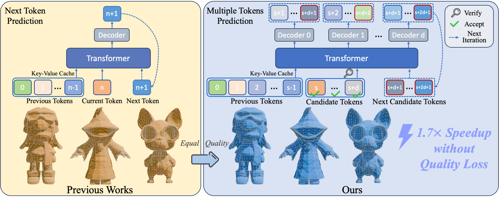

  <h1 align="center"> <b>XSpechMesh</b></h1> 

  

	

  Official implementation of the paper: 
  <strong>“XSpecMesh: Quality-Preserving Auto-Regressive Mesh Generation Acceleration via Multi-Head Speculative Decoding”</strong>

  

## ⚡ TL;DR
**XSpecMesh enables lossless acceleration of mesh autoregressive generation methods, achieving speed-ups of up to 1.7×.**

Code, Dataset, and Models will be released soon, stay tuned!
